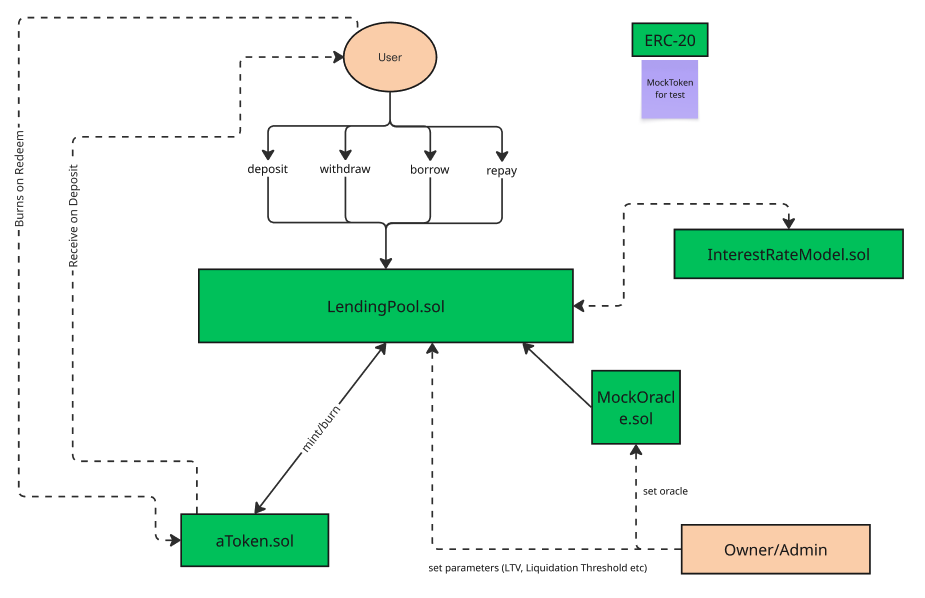

# Mini-Aave Protocol

[](https://soliditylang.org)  
[]()  
[]()

A minimal implementation of an AAVE-like lending protocol built with Solidity ^0.8.20 and Foundry for portfolio

## Overview

This protocol allows users to:

- **Deposit** assets to earn interest
- **Borrow** assets against collateral
- **Liquidate** undercollateralized positions
- **Repay** debt to restore health factor

## Contracts

All contracts are deployed to Sepolia Testnet:

LendingPool - https://sepolia.etherscan.io/address/0xd5f40fe9BdC674238708a690F6f61BD0CD36e02E

AToken - https://sepolia.etherscan.io/address/0x16E6178514070d9F290f1C6f04075B512bb71386

InterestRateModel - https://sepolia.etherscan.io/address/0x03c018CeAa3ca8eA3453bC3C4C178f381526c342

MockOracle - https://sepolia.etherscan.io/address/0x443DDD2cCbF0993287F66799531ab12DE3d80AcD

## Architecture



## Key Components

### 1. LendingPool

Core contract managing deposits, borrows, and liquidations.

### 2. AToken

Interest-bearing token representing user's share in the pool.

### 3. InterestRateModel

Piecewise linear interest rate calculation based on utilization.

### 4. MockOracle

Simple price oracle for testing (replace with Chainlink in production).

## Interest Rate Formula

The protocol uses a piecewise linear interest rate model:

```
BorrowRate = baseRate + (U <= kink ? U*slope1 : kink*slope1 + (U-kink)*slope2)
```

Where:

- `U` = utilization rate (totalBorrows / totalLiquidity)
- `baseRate` = 2% APR
- `slope1` = 10% APR (below kink)
- `slope2` = 100% APR (above kink)
- `kink` = 80% utilization

## Health Factor

```
HealthFactor = (totalCollateral * liquidationThreshold) / totalDebt
```

- Health Factor < 1.0: Position can be liquidated
- Health Factor ≥ 1.0: Position is healthy

## Liquidation Process

1. **Trigger**: Health Factor < 1.0
2. **Close Factor**: Max 50% of debt can be repaid in one liquidation
3. **Liquidation Bonus**: 5% discount on collateral for liquidators
4. **Formula**: `collateralToSeize = repayAmount * (1 + liquidationBonus) * debtPrice / collateralPrice`

## Test Coverage

```
╭---------------------------------+------------------+------------------+----------------+----------------╮
| File                            | % Lines          | % Statements     | % Branches     | % Funcs        |
+=========================================================================================================+
| contracts/AToken.sol            | 100.00% (13/13)  | 100.00% (8/8)    | 50.00% (2/4)   | 100.00% (5/5)  |
|---------------------------------+------------------+------------------+----------------+----------------|
| contracts/ERC20Mock.sol         | 50.00% (4/8)     | 50.00% (2/4)     | 100.00% (0/0)  | 50.00% (2/4)   |
|---------------------------------+------------------+------------------+----------------+----------------|
| contracts/InterestRateModel.sol | 90.91% (10/11)   | 90.00% (9/10)    | 50.00% (1/2)   | 100.00% (2/2)  |
|---------------------------------+------------------+------------------+----------------+----------------|
| contracts/LendingPool.sol       | 93.37% (169/181) | 93.27% (194/208) | 54.29% (38/70) | 84.62% (11/13) |
|---------------------------------+------------------+------------------+----------------+----------------|
| contracts/MockOracle.sol        | 100.00% (7/7)    | 100.00% (5/5)    | 50.00% (2/4)   | 100.00% (2/2)  |
|---------------------------------+------------------+------------------+----------------+----------------|
| Total                           | 92.27% (203/220) | 92.77% (218/235) | 53.75% (43/80) | 84.62% (22/26) |
╰---------------------------------+------------------+------------------+----------------+----------------╯

```

\*It's not covering all of ERC20 because it's mock token for example usage.

## Setup

### Prerequisites

- Foundry
- Node.js (for deployment scripts)

### Installation

```bash
# Clone and setup
git clone <repo>
cd mini-aave

# Install dependencies
forge install OpenZeppelin/openzeppelin-contracts
forge install foundry-rs/forge-std

# Build
forge build

# Run tests
forge test

# Run with gas report
forge test --gas-report
```

### Local Development

```bash
# Start local node
anvil

# Deploy contracts (in another terminal)
forge script scripts/deploy.js --rpc-url http://127.0.0.1:8545 --broadcast
```

## Testing

### Unit Tests

```bash
# Run all tests
forge test

# Run specific test
forge test --match-test testDeposit

# Run with verbosity
forge test -vvv
```

### Fuzz Testing

```bash
# Run fuzz tests
forge test --fuzz-runs 1000
```

### Invariant Testing

```bash
# Run invariant tests
forge test --invariant-runs 1000
```

## Security Features

- **ReentrancyGuard**: Prevents reentrancy attacks
- **SafeERC20**: Safe token transfers
- **Health Factor Checks**: Prevents undercollateralized positions
- **Access Control**: Owner-only admin functions
- **Input Validation**: Comprehensive parameter validation

```
slither .
```

- **0 critical**
- **2 Medium** (on aToken and IERC20 - known, not issue)
- **3 Lows**
- **4 Info**

## Known Limitations

1. **No Flash Loans**: Simplified implementation
2. **Single Oracle**: No price validation
3. **No Governance**: Centralized admin control
4. **Limited Assets**: Supports 1-2 test tokens
5. **No Interest Distribution**: Simplified aToken model

## Demo Flow

1. **Deploy** contracts
2. **Mint** test tokens to users
3. **Deposit** collateral (WETH)
4. **Borrow** against collateral
5. **Manipulate** oracle price
6. **Liquidate** undercollateralized position

## Gas Optimization

- **Struct Packing**: Efficient storage layout
- **Assembly**: Gas-optimized calculations
- **Batch Operations**: Multiple operations in single transaction
- **Event Optimization**: Minimal event emissions

## Production Considerations

For production deployment, i would add:

1. **Oracle Security**: Chainlink with multiple price feeds
2. **Governance**: Implement decentralized governance
3. **Flash Loans**: Add flash loan functionality
4. **Multi-Asset**: Support multiple collateral types
5. **Interest Distribution**: Implement proper interest accrual
6. **Emergency Pause**: Add circuit breakers
7. **Audit**: Professional security audit

## License

MIT
